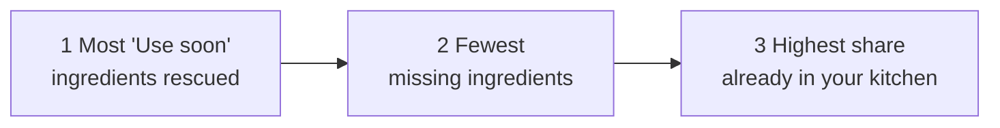

<div align="center">

# Use It Up

**Tell it what's in your kitchen. It finds what you can cook tonight, starting with the food that's about to go bad.**

[](https://yeseniananneliza.github.io/Use-It-Up/)
&nbsp;

&nbsp;


<!-- Replace this line with a 20-second GIF: sample kitchen → mark spinach "Use soon" → open a recipe → scale servings → grocery list -->

</div>

---

## The problem

People overspend on groceries and throw food away. Not because they lack recipes, but because nothing connects recipes to what's actually in their fridge.

Recipe sites start from the dish. **Use It Up starts from the kitchen**, and it puts the food that's about to expire first.

**Built for** students and early-career professionals cooking for one or two: they have ingredients at home, but struggle to decide what to cook before those ingredients go bad.

## Try it in 60 seconds

1. Open the **[live demo](https://yeseniananneliza.github.io/Use-It-Up/)** and choose **Try a sample kitchen**.
2. Spinach is already marked **Use soon**, so recipes that use it jump to the top.
3. Open a recipe: scale the servings, check off steps as you cook, and see swaps for anything you're missing.
4. Add two or three recipes to your plan, then open the **grocery list**: everything missing across all of them, combined and sorted by aisle.

## What it does

| | |
|---|---|
| **Your kitchen** | Add ingredients with type-ahead search. Mark anything that needs to be used soon. |
| **Rescue first** | Recipes that use your "Use soon" food rank above everything else, with a flag on the card. |
| **25 recipes, 14 cuisines** | From shakshuka to jollof rice to bibimbap, each with a real food photo. |
| **Ready to cook** | Every card shows how many ingredients you have, what's left to buy, and how long it takes. |
| **Servings scaler** | Amounts rescale and round to real kitchen fractions: 1 1/2 cups, not 1.4999. |
| **Ingredient swaps** | Missing butter? The recipe suggests olive oil. |
| **One grocery list** | Missing ingredients from every planned recipe, merged, grouped by aisle, with check-off, copy and print. |
| **Remembers you** | Your kitchen, plan and saved recipes persist in your browser. |

## How the ranking works

Every recipe is scored against your kitchen:

```js
have    = ingredients you already have
missing = ingredients you don't
rescue  = ingredients you marked "Use soon"
```

The default sort, **Uses expiring food first**, orders recipes by:



So a recipe that saves your wilting spinach beats one you could make with zero shopping. That's the whole point: **reduce waste first, then minimize the grocery run.** You can also sort by fewest missing ingredients or quickest.

The **"Best match for tonight"** card at the top uses the same logic to answer the question most people actually have: *what should I make right now?*

## Under the hood

**Servings scaling.** Recipe amounts are free text like `1 1/2 cups`. The scaler parses mixed numbers, fractions and decimals, multiplies, then snaps to the nearest cook-friendly fraction (1/4, 1/3, 1/2, 2/3, 3/4). Scaling `1 1/2 cups` by 2 gives `3 cups`, not `3.0000001`.

**Grocery list merging.** Missing ingredients from every planned recipe are merged into one entry per ingredient, listing each recipe's amount, so you buy garlic once instead of three times. Items are grouped by store aisle.

**Photos that fail gracefully.** Each recipe has a hand-picked, free-license food photo with alt text describing the actual dish, cropped per slot (4:3 cards, 16:9 "tonight" card, 21:6 hero, taller on phones) and served at 2× for sharp screens. If a photo fails to load, the card falls back to a line-drawn icon of the dish, and screen readers switch to the icon's label.

**Storage that can't break the app.** Everything saves to `localStorage` through a wrapper that never throws, so private browsing or blocked storage just means the app works in memory.

## Accessibility

- Ingredient search is a proper combobox: arrow keys move through suggestions (`aria-activedescendant`), Enter adds, Escape closes.
- Recipe pages and the grocery drawer move focus in on open and back to where you were on close.
- Result counts and confirmations are announced with `aria-live`.
- Ingredient meters have text labels ("You have 4 of 6 ingredients"), not just colored bars.
- Motion respects `prefers-reduced-motion`.

## Product decisions

- **Sample kitchen or empty kitchen, your choice.** The first version opened with a kitchen already filled in, and it wasn't clear what was the user's and what was a demo. First-time visitors now choose.
- **Cut from v1:** barcode scanning, price tracking and a live recipe API. Each needs an external service and would have delayed testing the core loop.
- **Moved into v1:** the grocery list. It started on the "later" list, then moved up once it was clear it was pure logic with no dependencies.
- **Free-license photos only.** Every photo is from Unsplash's free license (no Unsplash+ or stock), checked by eye to match the dish.

## Validation

I'm running short, moderated sessions where people open the site cold and plan a dinner from their own fridge. I'm tracking:

1. How long it takes to open a recipe they'd actually cook.
2. Whether "Use soon" makes sense without an explanation.
3. Whether the combined grocery list catches items they'd otherwise buy twice.
4. Which step causes the most hesitation.

<!-- RESULTS: add 3-4 sentences of real findings here after testing -->

## What's next

1. **Expiry dates, not just a flag**, so recipes rank by how soon food actually goes bad.
2. **A live recipe API** to grow past 25 recipes.
3. **Barcode scanning** to add groceries in one tap.
4. **Accounts**, so a kitchen follows you between devices.

## Run it locally

Download `index.html` and open it in your browser.

`app.py` serves the same page on Streamlit Community Cloud.

---

<div align="center">

Built by **Yesenia Navarro** as a product case study.
Food photos from [Unsplash](https://unsplash.com/?utm_source=use_it_up&utm_medium=referral) under the Unsplash License.

</div>
